# 📘 Docura: System Architecture & Design Decisions

> This document explains *why* the system was designed the way it was, not just *what* it does. It is intended for technical readers: senior engineers, tech leads, and anyone performing due diligence on the system.

---

## Table of Contents
1. [Architectural Philosophy](#1-architectural-philosophy)
2. [The Dual-AI Provider Strategy](#2-the-dual-ai-provider-strategy)
3. [Document Ingestion (ETL) Pipeline](#3-document-ingestion-etl-pipeline)
4. [The RAG Query Engine](#4-the-rag-query-engine)
5. [Text Chunking Algorithm](#5-text-chunking-algorithm)
6. [Multi-Tenant Data Isolation](#6-multi-tenant-data-isolation)
7. [Database Schema & Entity Model](#7-database-schema--entity-model)
8. [JWT Security Filter Chain](#8-jwt-security-filter-chain)
9. [Spring Boot Profile System](#9-spring-boot-profile-system)
10. [Frontend Architecture](#10-frontend-architecture)
11. [Known Design Trade-Offs](#11-known-design-trade-offs)

---

## 1. Architectural Philosophy

Docura is built on three core principles:

1. **Privacy by Default** — User document data never leaves the infrastructure boundary for the embedding step. Embeddings are the DNA of your documents; generating them locally is a hard requirement.
2. **Strict Tenant Isolation** — In a multi-user system, data leakage between tenants is the single worst failure mode. The system enforces isolation at every layer: JPA, SQL, and Spring Security's `@AuthenticationPrincipal`.
3. **Production-Readiness from Day One** — Every feature includes: metrics (Micrometer), structured logging (SLF4J), rate limiting (Bucket4j), and transactional integrity (`@Transactional`).

---

## 2. The Dual-AI Provider Strategy

The biggest architectural challenge in this project was balancing:

- **Embedding Cost/Privacy**: Sending 1,000 document chunks to OpenAI's embedding API costs money and exposes private data.
- **Generation Quality/Speed**: Running a 70B parameter LLM locally requires hardware most teams don't have.

**The Solution:** A swappable AI provider architecture using Spring AI abstractions.


**⚠️ Critical Compatibility Note**: `nomic-embed-text` (local) produces **768-dimensional** vectors. `all-MiniLM-L6-v2` (prod) produces **384-dimensional** vectors. These two embedding spaces are **completely incompatible** — you cannot query vectors indexed with one model using the other. Always use a single profile consistently per database instance.

---

## 3. Document Ingestion (ETL) Pipeline

The `DocumentService.uploadAndProcessDocument()` method orchestrates the entire pipeline in a **single `@Transactional` boundary**, guaranteeing atomicity.

```mermaid
flowchart TD
    A([Start: MultipartFile]) --> B[FileStorageService.isValidFileType]
    B -->|Invalid: PDF/DOCX/TXT only| Z1([Throw RuntimeException 400])
    B -->|Valid| C[FileStorageService.storeFile]
    C --> D[Generate UUID filename]
    D --> E[Save Document entity to DB - get ID]
    E --> F[DocumentParserService.parseDocument]
    
    F --> F1{ContentType?}
    F1 -->|application/pdf| F2[Apache PDFBox extractor]
    F1 -->|application/vnd.openxmlformats-officedocument| F3[Apache POI extractor]
    F1 -->|text/plain| F4[Direct UTF-8 reader]
    F2 & F3 & F4 --> G[Raw String text]
    
    G --> H[TextChunkingService.chunkText]
    H --> I[List of String chunks]
    
    I --> J{For each chunk i}
    J --> K[EmbeddingService.generateEmbedding]
    K --> L[ONNX MiniLM-L6-v2 → float-384]
    L --> M[embeddingToVector → pgvector format]
    M --> N[DocumentChunk.save - content, embedding, chunk_index, token_count]
    N -->|Next chunk| J
    J -->|Done| O([Return saved Document])
```



**File Format Support:**
- `.pdf` — Apache PDFBox 3.x (handles encrypted, scanned-to-PDF, and complex layouts)
- `.docx` — Apache POI 5.x (extracts paragraph text, preserving structure)
- `.txt` — Standard UTF-8 Java reader

---

## 4. The RAG Query Engine

The `RAGQueryService` is the heart of the chatting feature. It implements the classic **Retrieval → Augment → Generate** pattern:

```
Step 1 (Retrieve):   Embed user question → search pgvector → top 7 chunks
Step 2 (Augment):    Inject chunks into Spring AI SystemPrompt as context
Step 3 (Generate):   Send augmented prompt to Groq LLaMA → stream back SSE
```

**Why Top 7 chunks?** Through empirical testing, 7 chunks at 2000 characters each provides approximately 3,000–4,000 tokens of context — enough for a thorough, grounded answer without overflowing the context window or incurring excessive API costs.

**Conversation Threading**: After the first message creates a `Conversation` entity, subsequent messages are appended via `addMessageToConversation()`. This full `Conversation → ConversationMessage` hierarchy is stored in PostgreSQL, giving users persistent chat history.

---

## 5. Text Chunking Algorithm

The `TextChunkingService` implements a character-based sliding window with sentence boundary intelligence.

```java
// Constants from TextChunkingService.java
private static final int CHUNK_SIZE    = 2000; // ~500 tokens
private static final int CHUNK_OVERLAP = 200;  // Prevents context loss at boundaries
```

**The Algorithm:**
1. Start `pointer` at 0.
2. Take a chunk from `[pointer, pointer + 2000]`.
3. **Sentence boundary backtrack**: if there is a `. ` within the second half of the chunk, set the end there.
4. Add chunk to list.
5. Move `pointer` to `end - 200` (the 200-char overlap ensures that terms crossing chunk boundaries are in at least one full chunk).
6. Repeat until `pointer >= text.length()`.

**Why Overlap Matters**: Without overlap, a key phrase that happens to land at a chunk boundary will be split across two chunks. A complete sentence that mentions "the 15% VAT rate applies" might be split into "the 15% VAT" in chunk 3 and "rate applies" in chunk 4. The 200-char overlap ensures the complete phrase is always present in at least one chunk, significantly improving retrieval accuracy.

---

## 6. Multi-Tenant Data Isolation

This is the security-critical architectural feature. The vector search SQL query — the one that retrieves context for LLM generation — enforces tenant isolation at the SQL level:

```sql
-- From VectorSearchService.searchSimilarChunksForUser()
SELECT 
    dc.id,
    dc.document_id,
    dc.chunk_index,
    dc.content,
    dc.token_count,
    d.filename,
    1 - (dc.embedding::vector <=> ?::vector) as similarity
FROM document_chunks dc
JOIN documents d ON dc.document_id = d.id
WHERE d.user_id = ?          -- ← Tenant isolation enforced here at SQL level
  AND dc.embedding IS NOT NULL
ORDER BY dc.embedding::vector <=> ?::vector
LIMIT ?
```

The `WHERE d.user_id = ?` clause is injected with the `userId` value extracted from the JWT token via `@AuthenticationPrincipal`. This means even if an attacker crafts a request with a custom body attempting to access another user's conversation ID, the SQL will return zero rows.

**Layered Security for Data Access:**
1. **JWT Layer**: Request rejected if token is invalid/expired (HTTP 401).
2. **Ownership Check Layer**: `conversationService.getConversation(id, user.getId())` throws at service layer if wrong user.
3. **SQL Layer**: Vector search has hard `user_id = ?` constraint — no bypass possible.

---

## 7. Database Schema & Entity Model


**N+1 Query Prevention**: When fetching a `Conversation` with its `ConversationMessage` list, Hibernate would normally trigger N+1 SQL queries. This is prevented with:

```java
// ConversationRepository.java
@EntityGraph(attributePaths = {"messages"})
List<Conversation> findByUserIdOrderByUpdatedAtDesc(Long userId);

@EntityGraph(attributePaths = {"messages"})
Optional<Conversation> findByIdAndUserId(Long id, Long userId);
```

This forces a single `JOIN FETCH` SQL statement, which is why `spring.jpa.open-in-view: false` is safely set to `false` in production (avoiding lazy DB connection exhaustion).

---

## 8. JWT Security Filter Chain

Spring Security filters execute in a precise, order-dependent chain:

```
Incoming Request
       │
       ▼
  CorsFilter          ← Adds CORS headers (configured in SecurityConfig)
       │
       ▼
  JwtAuthenticationFilter  ← [CUSTOM]
  - Reads "Authorization: Bearer <token>" header
  - Extracts email from HS256 token
  - Loads User from DB
  - Sets SecurityContextHolder with UsernamePasswordAuthenticationToken
       │
       ▼
  RateLimitFilter     ← [CUSTOM] Runs AFTER JWT (can check if user is authenticated)
  - Authenticated users → 100 req/min bucket (keyed by user ID)
  - Unauthenticated IPs → 10 req/min bucket (keyed by IP)
  - Returns 429 + "Retry-After" header on exhaustion
       │
       ▼
  RAGRateLimitFilter  ← [CUSTOM] Only triggers on /conversations/* endpoints
  - Authenticated → 20 RAG queries/min
  - Unauthenticated → 5 RAG queries/min
       │
       ▼
  AuthorizationFilter ← Spring default: checks .authenticated() rules
       │
       ▼
  Controller Method   ← @AuthenticationPrincipal injects the loaded User entity
```

**JWT Token Specifications** (from `application.yaml`):
- Algorithm: `HS256`
- Access token expiry: `86,400,000ms` = **24 hours**
- Refresh token expiry: `604,800,000ms` = **7 days**
- Password hashing: `BCryptPasswordEncoder` (Spring default cost factor: 10 rounds)

---

## 9. Spring Boot Profile System

The system uses two Spring Boot profiles to manage environment-specific AI configurations:

| Profile | Chat Model | Embedding Model | Dimensions |
|---|---|---|---|
| `local` | Ollama `llama3.2` (local) | Ollama `nomic-embed-text` (local) | **768** |
| `prod` | Groq `llama-3.3-70b-versatile` | ONNX `all-MiniLM-L6-v2` (JVM) | **384** |

> ⚠️ **Critical**: These two embedding models produce vectors of **different dimensions** (768 vs 384). Documents indexed on the `local` profile cannot be queried from the `prod` profile — and vice versa. Switching profiles on a database that already contains vectors will cause cosine similarity failures. Always use one profile consistently per database, or wipe and re-index when switching.

The `application-prod.yaml` explicitly excludes `OllamaAutoConfiguration` to prevent Spring AI from attempting to connect to a non-existent local Ollama server:
```yaml
spring:
  autoconfigure:
    exclude:
      - org.springframework.ai.autoconfigure.ollama.OllamaAutoConfiguration
```

Swagger UI is also disabled in production for security:
```yaml
springdoc:
  api-docs:
    enabled: false
  swagger-ui:
    enabled: false
```

---

## 10. Frontend Architecture

The React frontend uses a **Feature-Sliced Design** pattern:

```
src/
├── features/
│   ├── chat/
│   │   ├── components/         # ConversationHistory, ChatInput, MessageBubble
│   │   ├── hooks/              # useChat.ts (React Query mutations)
│   │   └── api/                # documentApi.ts
│   ├── documents/
│   │   ├── components/         # DocumentLibrary, DocumentCard, UploadZone
│   │   └── api/
│   └── auth/
├── contexts/
│   └── AuthContext.tsx          # JWT state: tokens, user, refresh logic
├── services/
│   └── authService.ts           # transformAuthResponse(), login(), register()
└── store/
    └── chatStore.ts             # Zustand: conversation list, active chat
```

**Key Frontend Patterns:**
- **Axios Interceptors**: Every request automatically gets `Authorization: Bearer <token>` header. 401 responses trigger automatic token refresh.
- **React Query**: All server state (document list, conversations) is cached and invalidated on mutations. After a new conversation is created, `queryClient.invalidateQueries(['conversations'])` auto-refreshes the sidebar.
- **SSE Streaming**: The AI response stream is consumed via the browser's native `EventSource` API — the backend sends individual tokens as `text/event-stream` events, creating the typewriter effect.

---

## 11. Known Design Trade-Offs

| Decision | Trade-Off |
|---|---|
| **`embedding` stored as `TEXT`, cast at query time** | Simpler Hibernate mapping vs. marginally slower casting. Full `vector` column type would eliminate cast overhead. |
| **No connection pool tuning** | Using HikariCP defaults for `t3.small`. Under heavy load, custom pool sizing would improve throughput. |
| **1-day conversation auto-cleanup** | Configured daily scheduled job (`@Scheduled(cron = "0 0 2 * * *")`). Aggressive cleanup keeps DB lean but may surprise users who return after a day. |
| **Chunk size: 2000 chars (~500 tokens)** | Good balance for most documents. Very technical PDFs with dense equations may benefit from smaller chunks (1000 chars) for better retrieval precision. |
| **No async document processing** | Currently synchronous — large PDFs may cause API timeout. A production v2 would use Spring's `@Async` or a message queue for long-running uploads. |
