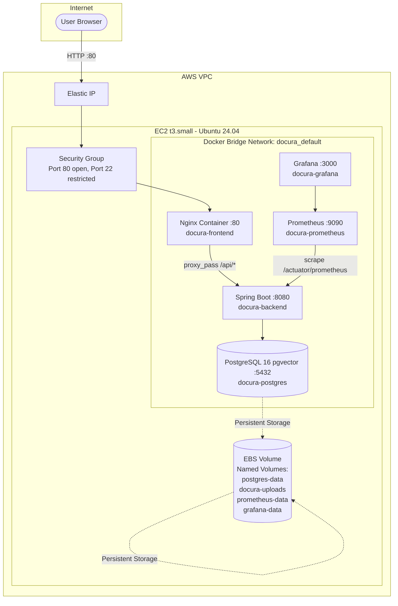

# 📙 Docura: Production Deployment Guide

> This guide covers the complete process of deploying Docura from zero — provisioning cloud infrastructure, configuring Docker Compose, running the stack, and setting up monitoring.

---

## Table of Contents
1. [Architecture Overview](#1-architecture-overview)
2. [Prerequisites](#2-prerequisites)
3. [AWS EC2 Provisioning](#3-aws-ec2-provisioning)
4. [Server Setup](#4-server-setup)
5. [Application Deployment](#5-application-deployment)
6. [Nginx Reverse Proxy Configuration](#6-nginx-reverse-proxy-configuration)
7. [Monitoring — Prometheus & Grafana](#7-monitoring--prometheus--grafana)
8. [Environment Variables Reference](#8-environment-variables-reference)
9. [Operational Runbook](#9-operational-runbook)
10. [Docker Image Build & Push](#10-docker-image-build--push)

---

## 1. Architecture Overview



**Key Design Decisions:**
- **Port 80 Only**: Nginx is the single public entry point. Port 8080 (backend) and 5432 (DB) are never exposed externally.
- **Named Volumes**: All data persists independently of container lifecycle. `docker compose down` never destroys database data.
- **Private Dashboard Ports**: Ports 3000 (Grafana) and 9090 (Prometheus) are closed to the internet by default. Open them via AWS Security Groups temporarily using "My IP" when needed.

---

## 2. Prerequisites

- **Local machine**: Docker Desktop, Git
- **AWS account** with permissions to: EC2, Security Groups, Elastic IPs
- **Docker Hub account**: for hosting multi-stage container images
- **Groq API Key**: from [console.groq.com](https://console.groq.com)

---

## 3. AWS EC2 Provisioning

### 3.1 Launch an EC2 Instance

1. Navigate to **EC2 → Launch Instance** in your AWS console.
2. **Configuration:**
   - **AMI**: Ubuntu Server 24.04 LTS (HVM), SSD Volume Type (`x86_64`)
   - **Instance type**: `t3.small` (2 vCPU, 2 GB RAM — minimum for Spring Boot + ONNX)
   - **Key pair**: Create a new RSA key pair, download the `.pem` file
   - **Storage**: 20 GB `gp3` root volume

### 3.2 Configure Security Groups

Create a new Security Group with these **Inbound Rules**:

| Port | Protocol | Source | Purpose |
|---|---|---|---|
| `22` | TCP | **My IP** (your residential IP only) | SSH access |
| `80` | TCP | `0.0.0.0/0, ::/0` | Public web access |
| `9090` | TCP | **My IP** (add only when monitoring) | Prometheus UI |
| `3000` | TCP | **My IP** (add only when monitoring) | Grafana UI |

> ⚠️ **Never** open port `5433` (PostgreSQL) or `8080` (Spring Boot) to the internet. These are internal Docker network ports only.

### 3.3 Allocate an Elastic IP

For a stable IP address:
1. **EC2 → Elastic IPs → Allocate Elastic IP Address**
2. After allocation, **Associate** it with your new EC2 instance.

---

## 4. Server Setup

### 4.1 SSH Into Your Server

```bash
# Replace with the path to your .pem key and your Elastic IP
chmod 400 ~/Downloads/docura-key.pem
ssh -i ~/Downloads/docura-key.pem ubuntu@<your-elastic-ip>
```

### 4.2 Install Docker Engine

```bash
# Update package index
sudo apt-get update

# Install Docker
sudo apt-get install -y docker.io

# Install Docker Compose Plugin (not the legacy docker-compose)
sudo apt-get install -y docker-compose-plugin

# Add ubuntu user to docker group (avoids needing sudo for docker commands)
sudo usermod -aG docker ubuntu

# Reload session to apply group change
newgrp docker

# Verify
docker --version
docker compose version
```

### 4.3 Clone the Deployment Repository

```bash
cd ~
git clone https://github.com/YasasBanuka/docura-deployment.git
cd docura-deployment
ls -la
# Expected: docker-compose.yml  nginx.conf  prometheus.yml  .env.example
```

---

## 5. Application Deployment

### 5.1 Configure Environment Variables

```bash
cp .env.example .env
nano .env   # or vim .env
```

Fill in the required values (see [Section 8](#8-environment-variables-reference)):
```env
DB_USERNAME=docura_admin
DB_PASSWORD=<generate-a-strong-password>
JWT_SECRET=<generate-256-bit-random-string>
GROQ_API_KEY=gsk_<your-groq-key>
SPRING_PROFILES_ACTIVE=prod
```

Generate a secure JWT secret:
```bash
# On Linux/Mac
openssl rand -hex 64
```

### 5.2 Launch the Stack

```bash
# Pull all images from Docker Hub and start containers
docker compose up -d

# Monitor startup logs
docker compose logs -f --tail=50

# Verify all 5 containers are running
docker compose ps
```

Expected output:
```
NAME                STATUS
docura-postgres     running
docura-backend      running (healthy after ~30s)
docura-frontend     running
docura-prometheus   running
docura-grafana      running
```

### 5.3 Enable pgvector Extension (First Run Only)

The `pgvector` extension must be manually enabled once per database. This is a one-time operation:

```bash
docker exec -it docura-postgres \
  psql -U $DB_USERNAME -d docura \
  -c "CREATE EXTENSION IF NOT EXISTS vector;"
```

Verify:
```bash
docker exec -it docura-postgres \
  psql -U $DB_USERNAME -d docura \
  -c "\dx"
# Should show 'vector' in the list of installed extensions
```

### 5.4 Verify the Deployment

```bash
# Test the health endpoint
curl http://localhost/api/actuator/health
# Expected: {"status":"UP"}

# Test the frontend is serving
curl -I http://localhost
# Expected: HTTP/1.1 200 OK, Content-Type: text/html
```

---

## 6. Nginx Reverse Proxy Configuration

The Nginx configuration in `nginx.conf` serves a dual purpose:

```nginx
server {
    listen 80;
    server_name localhost;

    # React static build files
    root /usr/share/nginx/html;
    index index.html;

    # API Proxy: all /api/* requests → Spring Boot backend container
    location /api/ {
        proxy_pass http://backend:8080/api/;
        proxy_set_header Host $host;
        proxy_set_header X-Real-IP $remote_addr;
        proxy_set_header X-Forwarded-For $proxy_add_x_forwarded_for;
        
        # Critical for SSE streaming (RAG chat typewriter effect)
        proxy_set_header Connection '';
        proxy_http_version 1.1;
        chunked_transfer_encoding off;
        proxy_buffering off;
        proxy_cache off;
    }

    # SPA Fallback: React Router client-side routing
    location / {
        try_files $uri $uri/ /index.html;
    }
}
```

**Why `proxy_buffering off`?** This is critical for Server-Sent Events (SSE). The RAG chat feature streams individual tokens from Groq via `text/event-stream`. Without `proxy_buffering off`, Nginx would buffer the entire response before sending it to the browser, breaking the typewriter effect and creating 30-second delays.

**Why `http_version 1.1`?** HTTP/1.0 does not support persistent connections, which are required for SSE. Setting `proxy_http_version 1.1` with `Connection ''` enables keep-alive connections.

---

## 7. Monitoring — Prometheus & Grafana

### 7.1 Access Dashboards

> First, temporarily add your IP to the Security Group for ports 3000 and 9090 (see [Section 3.2](#32-configure-security-groups)).

- **Prometheus**: `http://<your-ec2-ip>:9090`
- **Grafana**: `http://<your-ec2-ip>:3000` (default: `admin` / `admin`, change on first login)

### 7.2 Configure Grafana Data Source

1. **Grafana → Connections → Data Sources → Add new data source**
2. Select **Prometheus**
3. Set **URL**: `http://prometheus:9090` (Docker internal hostname — do NOT use `localhost`)
4. Click **Save & Test** → green "Data source is working"

### 7.3 Useful Prometheus Queries

```promql
# Total HTTP requests per endpoint
sum by (uri) (http_server_requests_seconds_count{application="docura"})

# 95th percentile response time
histogram_quantile(0.95, rate(http_server_requests_seconds_bucket[5m]))

# Active HikariCP database connections
hikaricp_connections_active{application="docura"}

# JPA repository invocations breakdown
rate(spring_data_repository_invocations_seconds_count[1m])

# JVM heap usage
jvm_memory_used_bytes{area="heap"}
```

### 7.4 Prometheus Scrape Configuration (from `prometheus.yml`)

Prometheus is configured to scrape the Spring Boot Actuator endpoint every 15 seconds:

```yaml
global:
  scrape_interval: 15s

scrape_configs:
  - job_name: 'docura-backend'
    static_configs:
      - targets: ['backend:8080']   # Docker internal hostname
    metrics_path: /actuator/prometheus
```

The `/actuator/prometheus` endpoint is publicly accessible (configured as `permitAll()` in `SecurityConfig`) because metrics contain no sensitive user data.

---

## 8. Environment Variables Reference

All secrets are provided via the `.env` file which Docker Compose loads automatically.

| Variable | Required | Description | Example |
|---|---|---|---|
| `DB_URL` | ✅ | Full JDBC URL pointing to postgres container | `jdbc:postgresql://postgres:5432/docura` |
| `DB_USERNAME` | ✅ | PostgreSQL superuser name | `docura_admin` |
| `DB_PASSWORD` | ✅ | PostgreSQL password | Strong random string |
| `JWT_SECRET` | ✅ | HS256 signing key (minimum 256 bits / 64 hex chars) | `openssl rand -hex 64` output |
| `GROQ_API_KEY` | ✅ (prod) | Groq Cloud API key | `gsk_...` |
| `UPLOAD_DIR` | Optional | Path inside container for stored files | `/app/uploads` |
| `SPRING_PROFILES_ACTIVE` | ✅ | Must be `prod` for Groq + ONNX mode | `prod` |

---

## 9. Operational Runbook

### Update the Application (Zero-Downtime Pull)

```bash
cd ~/docura-deployment

# Pull latest images from Docker Hub
docker compose pull

# Restart containers with new images (rolling restart)
docker compose up -d

# Confirm new image is running
docker compose ps
docker inspect docura-backend | grep Image
```

### View Application Logs

```bash
# Backend logs (most useful for debugging)
docker compose logs -f backend --tail=100

# All services
docker compose logs -f

# Specific error search
docker compose logs backend 2>&1 | grep "ERROR"
```

### Backup the Database

```bash
# Create a dump
docker exec docura-postgres pg_dump -U $DB_USERNAME docura > backup_$(date +%Y%m%d).sql

# Restore from dump
cat backup_20260227.sql | docker exec -i docura-postgres psql -U $DB_USERNAME -d docura
```

### Restart a Single Service

```bash
docker compose restart backend    # Restart only the Spring Boot backend
docker compose restart postgres   # Restart only the database
```

### Stop Everything

```bash
docker compose down           # Stop containers (data volumes are preserved)
docker compose down -v        # ⚠️ DANGER: Stop AND delete all volumes (data loss!)
```

---

## 10. Docker Image Build & Push

When you make code changes locally, rebuild and push the images for deployment.

### Backend (Spring Boot — Multi-Stage Build)

```bash
cd document-insight-backend

# Multi-stage: Maven build (stage 1) → Ubuntu Jammy JRE (stage 2)
# Must use --platform linux/amd64 to build for EC2 (even from Apple Silicon)
docker buildx build \
  --platform linux/amd64 \
  -t ybanuka/docura-backend:latest \
  --push .
```

**Why Ubuntu Jammy instead of Alpine?** The ONNX-based `spring-ai-transformers` library uses DJL (Deep Java Library) which requires `glibc` for native library loading. Alpine Linux uses `musl libc`, which is incompatible. Ubuntu Jammy provides a standard `glibc` environment.

### Frontend (React + Nginx — Multi-Stage Build)

```bash
cd document-insight-frontend

# Stage 1: Node.js builds the Vite/React SPA bundle
# Stage 2: Nginx Alpine serves the static files + reverse proxy
docker buildx build \
  --platform linux/amd64 \
  -t ybanuka/docura-frontend:latest \
  --push .
```

### Deploy to AWS

```bash
# SSH into EC2
ssh -i ~/Downloads/docura-key.pem ubuntu@<your-elastic-ip>

# Pull and restart
cd ~/docura-deployment
docker compose pull
docker compose up -d
```
