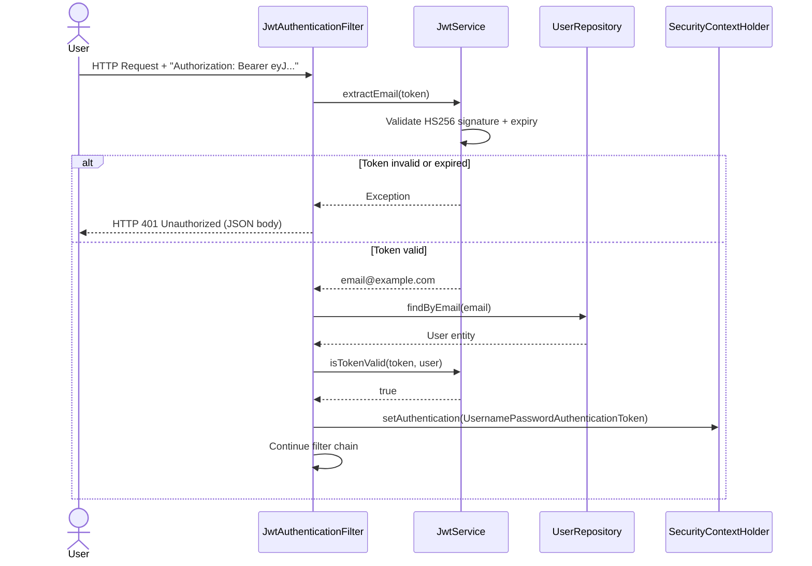

# 📕 Security Architecture & Testing Quality Report

> This document is intended for technical reviewers — engineering managers, security leads, and senior engineers — who want evidence that Docura is built to production-grade security and quality standards.

---

## Table of Contents
1. [Security Philosophy](#1-security-philosophy)
2. [Identity & Access Management (IAM)](#2-identity--access-management-iam)
3. [Multi-Tenant Data Isolation](#3-multi-tenant-data-isolation)
4. [API Defense — Rate Limiting](#4-api-defense--rate-limiting)
5. [CORS & Security Headers](#5-cors--security-headers)
6. [Input Validation & File Safety](#6-input-validation--file-safety)
7. [Production Security Hardening](#7-production-security-hardening)
8. [Testing Strategy — The Pyramid](#8-testing-strategy--the-pyramid)
9. [Key Test Cases Reference](#9-key-test-cases-reference)

---

## 1. Security Philosophy

Docura applies **defence-in-depth** — there is no single security layer. An attacker must bypass all of:

1. The Spring Security filter chain (JWT validation)
2. The custom rate limiter (Bucket4j)
3. The service layer ownership checks
4. The SQL `WHERE user_id = ?` clause on vector search

Only if all four layers were bypassed could a cross-tenant data access occur. Each layer is independently testable, and each is explicitly tested in the test suite.

---

## 2. Identity & Access Management (IAM)

### Authentication Flow

Docura uses **stateless JWT authentication** — there is zero server-side session state. This design decision enables horizontal scaling: any backend instance can validate any token without shared session storage.



### JWT Token Specifications

| Parameter | Value |
|---|---|
| Algorithm | `HS256` (HMAC-SHA256) |
| Access token expiry | `86,400,000 ms` = **24 hours** |
| Refresh token expiry | `604,800,000 ms` = **7 days** |
| Secret key source | `${JWT_SECRET}` environment variable (min 256 bits required) |
| Password hashing | `BCryptPasswordEncoder` (Spring Security default: 10 rounds) |
| Session strategy | `SessionCreationPolicy.STATELESS` — no cookies, no server-side sessions |

### Token Refresh Strategy

The frontend (`AuthContext.tsx`) stores both tokens in `localStorage`. The Axios interceptor pattern:
1. On every `401` response, attempt to call `POST /api/auth/refresh` with the stored refresh token.
2. If refresh succeeds, retry the original request with the new access token.
3. If refresh fails (expired refresh token), force logout and redirect to `/login`.

---

## 3. Multi-Tenant Data Isolation

This is the most critical security property. In a SaaS RAG engine, the most catastrophic failure would be User A's proprietary documents leaking into User B's context.

### Layer 1: SQL Filtering (Deepest Layer)

Every vector search query includes a hard tenant boundary:

```sql
-- From VectorSearchService.searchSimilarChunksForUser()
SELECT dc.id, dc.content, ... 
FROM document_chunks dc
JOIN documents d ON dc.document_id = d.id
WHERE d.user_id = ?       -- ← Hard-coded tenant filter
  AND dc.embedding IS NOT NULL
ORDER BY dc.embedding::vector <=> ?::vector
LIMIT ?
```

The `user_id` is taken directly from the JWT principal — it cannot be overridden by request body parameters.

### Layer 2: Service Layer Ownership Check

Before any conversation modification, ownership is explicitly verified:

```java
// ConversationService.addMessage()
Conversation conversation = conversationRepository
    .findByIdAndUserId(conversationId, user.getId())  // ← Dual key lookup
    .orElseThrow(() -> new RuntimeException("Conversation not found"));
```

If User A (`id=1`) tries to send a message to Conversation `id=7` (owned by User B `id=2`), the `findByIdAndUserId(7, 1)` returns `Optional.empty()`, and a `RuntimeException` is thrown before any data is read.

### Layer 3: JWT Principal Injection

Spring Security injects the authenticated `User` entity directly into controller methods via `@AuthenticationPrincipal`. There is no user-controlled parameter for "which user":

```java
// DocumentController — the userId ALWAYS comes from the JWT, never from the request
public ResponseEntity<UploadResponse> uploadDocument(
    @RequestParam("file") MultipartFile file,
    @AuthenticationPrincipal User user  // ← Injected by Spring Security
) {
    documentService.uploadAndProcessDocument(file, user.getId());
}
```

---

## 4. API Defense — Rate Limiting

Docura implements a **three-tier token-bucket rate limiter** using Bucket4j 8.16.x. Buckets are maintained in an in-memory `ConcurrentHashMap` keyed by user ID (authenticated) or client IP address (unauthenticated).

### Filter Order

The order of filter registration in `SecurityConfig.java` is intentional and critical:

```
JwtAuthenticationFilter  →  RateLimitFilter  →  RAGRateLimitFilter
```

The `RateLimitFilter` runs **after** `JwtAuthenticationFilter` so it can check `SecurityContextHolder.getContext().getAuthentication().isAuthenticated()` to determine which bucket to assign. Running it before JWT validation would mean all authenticated users are treated as unauthenticated.

### Bucket Configurations (from `application.yaml`)

```yaml
rate-limit:
  authenticated:
    capacity: 100          # Maximum burst
    refill-tokens: 100     # Tokens replenished per window
    refill-duration: 1m    # Refill window
  unauthenticated:
    capacity: 10
    refill-tokens: 10
    refill-duration: 1m
  rag:
    authenticated:
      capacity: 20
      refill-tokens: 20
      refill-duration: 1m
    unauthenticated:
      capacity: 5
      refill-tokens: 5
      refill-duration: 1m
```

### 429 Response Format (RFC 6585 Compliant)

```json
{
  "timestamp": "2026-02-27T20:00:00",
  "status": 429,
  "error": "Too Many Requests",
  "message": "Rate limit exceeded. Please retry after 60 seconds.",
  "path": "/api/documents/conversations",
  "retryAfter": 60
}
```

The `Retry-After` header is also set on the HTTP response per RFC 6585 Section 4.

---

## 5. CORS & Security Headers

CORS is configured in `SecurityConfig.corsConfigurationSource()` with explicit allowed origins (no wildcard):

```java
configuration.setAllowedOrigins(List.of(
    "http://localhost:5173",  // Vite dev server
    "http://localhost:3000",  // Alt dev port
    "http://localhost:4200"   // Angular dev (reserved)
));
configuration.setAllowedMethods(List.of("GET", "POST", "PUT", "DELETE", "OPTIONS"));
configuration.setExposedHeaders(List.of("Content-Disposition"));
configuration.setAllowCredentials(true);
```

> **Production Note:** For a deployed app, the allowed origins list must be updated to include the production domain (e.g., `http://your-ec2-ip`). The current list is permissive for local development.

CSRF protection is explicitly disabled (`AbstractHttpConfigurer::disable`) — this is correct for stateless JWT APIs since there is no cookie-based session that CSRF exploits.

---

## 6. Input Validation & File Safety

### File Type Validation (Double-Checked)

File uploads are validated at two layers:

1. **Spring Multipart Filter**: Rejects files exceeding `max-file-size: 10MB` / `max-request-size: 10MB`.
2. **Service Layer**: `fileStorageService.isValidFileType(contentType)` validates against a whitelist of MIME types. Arbitrary file types (e.g., `.exe`, `.sh`) are rejected.

### API Input Validation

All request DTOs use Jakarta Bean Validation annotations (`@NotNull`, `@Email`, `@Size`). A `@Valid` annotation on controller method parameters triggers automatic validation. Invalid payloads return structured `400 Bad Request` responses before reaching service logic.

---

## 7. Production Security Hardening

The `application-prod.yaml` profile applies additional security settings not active in development:

| Setting | Production Value | Reason |
|---|---|---|
| `springdoc.swagger-ui.enabled` | `false` | Prevents API schema exposure to the public internet |
| `springdoc.api-docs.enabled` | `false` | No OpenAPI JSON endpoint exposed |
| `OllamaAutoConfiguration` excluded | Yes | Prevents health check failures when Ollama is not running |
| `JWT_SECRET` | `${JWT_SECRET}` env var | Never hardcoded — injected at runtime via `.env` |
| `DB_PASSWORD` | `${DB_PASSWORD}` env var | Never in source control |

---

## 8. Testing Strategy — The Pyramid

The test suite follows the **Testing Pyramid** principle: many fast unit tests at the base, fewer integration tests in the middle, and a small number of E2E tests at the top.

```
         ┌──────────────────────┐
         │   End-to-End (E2E)   │  ← Playwright browser tests
         │       (fewest)       │     Real user journeys
         ├──────────────────────┤
         │  Integration Tests   │  ← MockMvc, @SpringBootTest
         │    (medium count)    │     Security boundary tests
         ├──────────────────────┤
         │     Unit Tests       │  ← @ExtendWith(MockitoExtension)
         │      (most)          │     Pure business logic
         └──────────────────────┘
```

### Coverage Summary

| Layer | Tool | Key Areas Covered |
|---|---|---|
| **Service Unit** | JUnit 5 + Mockito | `ConversationService`, `RateLimitService`, `TextChunkingService`, `DocumentService`, `RAGQueryService` |
| **Controller Integration** | MockMvc + `@SpringBootTest` | `DocumentController` security, `ConversationController` ownership, Rate limit filters |
| **Data Access** | `@DataJpaTest` + H2 | `DocumentRepository` user filtering, `ConversationRepository` cleanup logic |
| **Frontend Unit** | Vitest + RTL | `MessageBubble`, `ChatInput`, Zustand hooks, `useChat`, `useAuth` |
| **E2E** | Playwright | Register → Upload → Chat → History → Logout |

---

## 9. Key Test Cases Reference

### Security Isolation Tests (`DocumentControllerTest`)

| Test | Scenario | Expected |
|---|---|---|
| `getUserDocuments_ReturnsOnlyOwnerDocs` | User A requests User B's document ID | `403 Forbidden` before service layer executes |
| `deleteDocument_WrongUser_Returns403` | User A sends `DELETE /documents/5` (User B owns doc 5) | `403 Forbidden` |
| `uploadDocument_UnauthenticatedUser` | Request with no JWT token | `401 Unauthorized` |

### Tenant Isolation Tests (`ConversationServiceTest`)

| Test | Scenario | Expected |
|---|---|---|
| `deleteConversation_Success` | User A deletes their own conversation | `void` — deleted |
| `deleteConversation_NotFound_ThrowsException` | User A passes User B's conversation ID | `RuntimeException("Conversation not found")` |
| `addMessage_WrongOwner_Throws` | User A appends message to User B's conversation | `RuntimeException` at `findByIdAndUserId` |

### Rate Limit Tests (`RateLimitServiceTest`)

| Test | Scenario | Expected |
|---|---|---|
| `resolveBucket_Authenticated` | Authenticated user ID → bucket capacity | `100 tokens` bucket returned |
| `resolveBucket_Unauthenticated` | IP address → bucket capacity | `10 tokens` bucket returned |
| `getRetryAfterSeconds` | Exhausted bucket → retry duration | `60 seconds` |

### Pure Logic Tests (`TextChunkingServiceTest`)

| Test | Scenario | Expected |
|---|---|---|
| `chunkText_ShortText` | 100-char text | Single chunk returned |
| `chunkText_LongText` | 10,000-char text | Multiple chunks, all ≤ 2000 chars, no index errors |
| `chunkText_SentenceBoundary` | Text with `. ` at 1800 chars | Break happens at sentence, not mid-word |
| `chunkText_NullOrEmpty` | `null` / `""` input | Returns empty `List`, no NPE |

### JPA Data Access Tests (`@DataJpaTest`)

| Test | Tool | Scenario |
|---|---|---|
| `findByUserId_ReturnsCorrectUser` | H2 + `@DataJpaTest` | 3 users, 9 docs created — query returns only 3 for User 1 |
| `findByUpdatedAtBefore_CleanupLogic` | H2 | Conversations older than 1 day matched by cleanup query |
